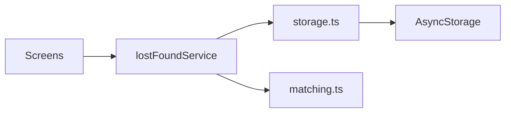

# Software Architecture — Vienna Lost & Found (M3)

## Overview

Expo 54 React Native app using **Expo Router** (file-based navigation).  
Persistence is **local only** via AsyncStorage; business logic lives in service modules.

## Libraries

| Library | Role |
|---------|------|
| expo-router | Navigation (tabs + stack) |
| @react-native-async-storage/async-storage | Local persistence |
| react-native-maps | Map view + markers |
| expo-image-picker | Optional photos on reports |
| react-native-qrcode-svg | Pickup QR code |
| zustand | App hydration / refresh state |

## Navigation

```
(tabs)
  Home | Search | Report | Map | Profile
(stack)
  report/lost, report/found
  matches/[reportId]
  match/[foundId]
  claim/verify → claim/progress → contact/safe-replies → claim/pickup
```

## Data flow

1. `initApp()` loads seed JSON into AsyncStorage on first launch.
2. Screens call `lostFoundService` methods (never AsyncStorage directly).
3. `matching.ts` scores found items against a lost report.
4. `useAppStore.refresh()` reloads data after writes.
5. Claims update report status (`searching` → `matched` → `at_depot` → `claimed`).



## Backend (prototypisch)

No server, authentication, or push notifications.  
Designed so a future REST API could replace `lostFoundService` internals without changing screen contracts.

## Maps

OpenStreetMap raster tiles via `UrlTile` on `MapView`.  
Item coordinates stored per found report; demo user position fixed at Karlsplatz.
