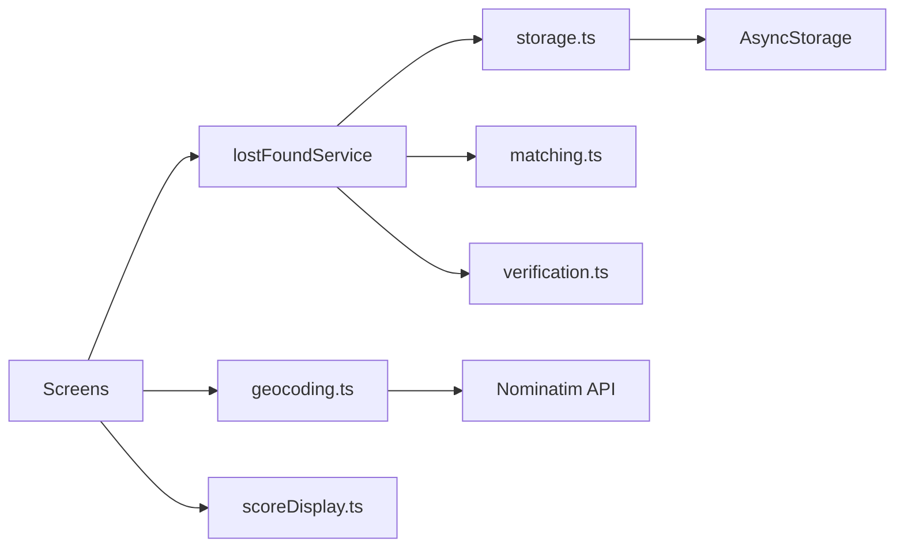

# Software Architecture — Vienna Lost & Found (M3/M4)

## Overview

Expo 54 React Native app using **Expo Router** (file-based navigation).  
Persistence is **local only** via AsyncStorage; business logic lives in service modules.

## Libraries

| Library                                   | Role                                            |
| ----------------------------------------- | ----------------------------------------------- |
| expo-router                               | Navigation (tabs + stack)                       |
| @react-native-async-storage/async-storage | Local persistence                               |
| react-native-webview                      | Map tab: hosts inline HTML with Leaflet         |
| expo-image-picker                         | Optional photos on reports                      |
| react-native-qrcode-svg                   | Pickup QR code                                  |
| zustand                                   | App hydration / refresh state                   |
| OpenStreetMap Nominatim (HTTP)            | Address search and geocoding in `AddressPicker` |

`react-native-maps` is **not** used (removed after crashes with native map modules in Expo Go).

## Navigation

```
(tabs)
  Home | Search | Report | Map | Profile
(stack)
  report/lost, report/found
  matches/[reportId]
  match/[foundId]
  claim/verify → claim/progress → contact/safe-replies → claim/pickup
```

## Service modules

| Module | Role |
|--------|------|
| `storage.ts` | AsyncStorage read/write; in-memory fallback |
| `initApp.ts` | Seed data on first launch; demo reset |
| `lostFoundService.ts` | Reports, found items, matches, claims |
| `matching.ts` | Rule-based match scoring; haversine distance |
| `geocoding.ts` | Nominatim search + throttle |
| `aiTags.ts` | Demo tag detection on Report Found |
| `scoreDisplay.ts` | Match score tiers, colors, labels (M4) |
| `verification.ts` | Ownership detail evaluation (M4) |

Screens never call AsyncStorage directly — they go through `lostFoundService` and `useAppStore.refresh()`.

## Data flow

1. `initApp()` loads seed JSON into AsyncStorage on first launch.
2. Screens call `lostFoundService` methods.
3. `matching.ts` scores found items against a lost report.
4. `useAppStore.refresh()` reloads data after writes.
5. Claims update report status (`searching` → `matched` → `at_depot` → `claimed`).



## M4: Match score display

**Module:** `services/scoreDisplay.ts`  
**UI:** `components/ui/ScoreBar.tsx`, match screens

- `getScoreTier(score)` — strong (≥70%), possible (≥40%), weak (&lt;40%)
- Bar and percentage use `theme.success` / `theme.warning` / `theme.muted`
- Match detail shows tier label and short explanation before “Why this match?”

## M4: Ownership verification

**Module:** `services/verification.ts`  
**UI:** `app/claim/verify.tsx`, `app/claim/progress.tsx`

1. User submits a secret detail on verify screen (with static “Good examples”).
2. `evaluateSecretDetail()` tokenizes input and compares to the found item description.
3. Result: `accepted` (≥2 token hits), `partial` (1 hit), or `rejected` (0 hits / too generic).
4. `createClaim()` stores `verifyResult` and `verifyMessage` on the claim.
5. Accepted/partial → auto-advance after ~2 s; rejected → progress shows message and **Try again**.

Rejected claims for the same report+found pair are updated on resubmit instead of duplicating.

## Backend (prototypisch)

No server, authentication, or push notifications.  
Designed so a future REST API could replace `lostFoundService` internals without changing screen contracts.

## Maps

**Implementation:** `components/map/OsmMapView.tsx`

1. React Native **`WebView`** loads a self-contained HTML document (string built in TypeScript).
2. **Leaflet 1.9** and its CSS are loaded from unpkg inside that HTML.
3. **OpenStreetMap** raster tiles: `https://tile.openstreetmap.org/{z}/{x}/{y}.png`.
4. Markers: numbered `L.marker` pins for each found item; `L.circleMarker` for demo user at Karlsplatz.
5. Native UI below the map: sorted list of items with distance; tap opens match detail.

Found items store `coordinates` per report. Demo user position is fixed at Karlsplatz (`constants/locations.ts`). Distances use haversine in `matching.ts`.

**Why WebView + Leaflet:** avoids native map SDK requirements and worked reliably on **Android (Expo Go / Pixel 6 emulator)** for the course demo.

## Location input

`components/location/AddressPicker.tsx` — used on Report Lost/Found:

- Quick picks from `constants/viennaPlaces.ts`
- Live search via `geocoding.ts` → Nominatim (throttled ~1 req/s, Austria bias)
- Resolves label + coordinates before submit

## M4: Item categories

`constants/categories.ts` — extended with **Keychain** and **ID / Card** (before **Other**) after usability study feedback.
